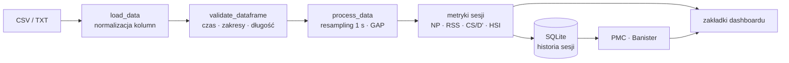

# Run Analytics Pro

[](https://github.com/WielkiKrzych/Analiza_Biegowa/actions/workflows/test.yml)
[](https://www.python.org/downloads/)
[](https://github.com/astral-sh/ruff)
[](https://opensource.org/licenses/MIT)

Biegowa platforma analityczna, w której intensywność wyraża **tempo, nie waty** — SmO₂, wentylacja i tętno są odnoszone do tempa (albo GAP), a progi, obciążenie i limiterzy liczone są na modelach właściwych dla biegania.

## 🧭 Spis treści

- [Czym to jest](#-czym-to-jest)
- [Szybki start](#-szybki-start)
- [Dane wejściowe](#-dane-wejściowe)
- [Co dostajesz](#-co-dostajesz)
- [Metodyka i metryki](#-metodyka-i-metryki)
- [Architektura](#-architektura)
- [Struktura projektu](#-struktura-projektu)
- [Testy i jakość](#-testy-i-jakość)
- [Konfiguracja](#-konfiguracja)
- [Stack technologiczny](#-stack-technologiczny)
- [Współpraca](#-współpraca)
- [Licencja](#-licencja)
- [Autor](#-autor)

## 🏃 Czym to jest

Run Analytics Pro to lokalna aplikacja do analizy sesji biegowych z pliku CSV/TXT: wczytuje jeden trening, przelicza go na spójny zbiór metryk i pokazuje w 18 zakładkach dashboardu. Powstała z potrzeby, której nie zaspokajają platformy „power-first”: biegacz bez miernika mocy (albo z miernikiem, ale analizujący głównie tempo) potrzebuje progów, dryfu i limiterów policzonych na tempie, GAP i tętnie, a nie na watach. Dlatego Normalized Pace używa normalizacji 3. potęgą prędkości w modelu Skiby (a nie 4. potęgi Coggana), GAP liczy koszt metaboliczny z modelu Minettiego, a zamiast CP/W′ pojawiają się Critical Speed i D′. Sygnały fizjologiczne — saturacja mięśniowa SmO₂, wentylacja VE, częstość oddechów BR, tętno — są zestawiane z osią tempa, bo to ona jest dla biegacza sterowalna i powtarzalna. Narzędzie jest jednoosobowe: analizuje pliki jednego zawodnika (Twoje albo podopiecznego), a wyniki trzyma lokalnie w bazie SQLite. Prognozy formy (PMC, Banister) liczą się z historii zapisanych sesji, nie z chmury.

## 🚀 Szybki start

Wymagany Python ≥ 3.10.

```bash
git clone https://github.com/WielkiKrzych/Analiza_Biegowa.git
cd Analiza_Biegowa

pip install -r requirements.txt

python3 -m streamlit run app.py
```

Streamlit wypisze adres aplikacji w terminalu. Wgraj plik CSV/TXT w sidebarze i ustaw parametry biegacza (patrz [Konfiguracja](#-konfiguracja)).

### Aplikacja natywna na macOS

```bash
bash build_biegowa_app.sh
```

Skrypt buduje applet AppleScript (`osacompile`) w `/Applications`, wstawia ikonę (`icon.png` → `AppIcon.icns`), podpisuje ad-hoc i dopina do Docka. Kliknięcie ikony uruchamia `launcher.sh`, który zarządza cyklem życia serwera Streamlit:

| Krok | Zachowanie |
|------|-----------|
| 1 | Szuka serwera Streamlit, którego **katalog roboczy** to ten projekt (pula portów `8510–8519`) |
| 2 | Jeśli serwer wystartował przed ostatnią zmianą kodu — restartuje go |
| 3 | Jeśli jest aktualny — reużywa i otwiera przeglądarkę |
| 4 | Jeśli żadnego nie ma — startuje na pierwszym wolnym porcie z puli |

Identyfikacja po katalogu roboczym (a nie po numerze portu) jest celowa: obok siebie bywa kilka projektów Streamlit i sama zajętość portu nie mówi, czyja aplikacja na nim stoi. Log uruchomienia: `/tmp/analiza_biegowa_launch.log`.

## 📥 Dane wejściowe

Wgrywany plik to **CSV lub TXT** (separator przecinek albo średnik). Wczytywanie idzie najpierw przez Polars, z fallbackiem na Pandas/pyarrow; pliki powyżej 100 000 wierszy czytane są w chunkach. Nazwy kolumn są sprowadzane do małych liter i mapowane z aliasów (np. `hr`, `bpm`, `tętno` → `heartrate`; `power`, `pwr`, `moc` → `watts`; `ve`, `ventilation` → `tymeventilation`), a brakujące wielkości są doliczane: `pace` z `speed_m_s`/`velocity_smooth`, `gct` z `stance_time` (albo z kadencji), `stride_length` z tempa i kadencji.

Co odrzuca plik: brak co najmniej jednej kolumny danych, mniej niż 10 rekordów, kolumna `time` nienumeryczna, a także wartości ponad limity sanity (99. percentyl: 3000 W, 250 bpm, 250 rpm). Kolumna `time` jest wymagana przez walidator, ale gdy jej nie ma, loader generuje ją z numeru wiersza. Kolumny liczbowe z pojedynczymi śmieciami są rzutowane na liczby; kolumna nienumeryczna jest pomijana z ostrzeżeniem w logu.

### Minimum do podstawowej analizy

| Kolumna | Jednostka | Rola |
|---------|-----------|------|
| `time` | s | oś czasu; generowana, jeśli brak |
| `pace` | s/km | tempo — intensywność bez miernika mocy |
| `speed_m_s` / `velocity_smooth` | m/s | prędkość; `pace` liczony automatycznie |
| `heartrate` | bpm | tętno (aliasy: `hr`, `heartrate`, `bpm`, `pulse`) |
| `cadence` | SPM | kadencja (aliasy: `cad`, `rpm`); dodatnia mediana < 120 jest podwajana (eksport Intervals.icu) |
| `distance` | m | dystans |
| `watts` / `power` | W | miernik mocy; gdy brak — moc szacowana z tempa/GAP |

### Do pełnej analizy (fizjologia i biomechanika)

| Kolumna | Jednostka | Skąd w kodzie wiadomo, co to jest |
|---------|-----------|-----------------------------------|
| `tymeventilation` | L/min | VE; obsługiwana też jako `ve` / `ventilation` |
| `tymebreathrate` | /min | BR; aliasy `br`, `rr`, `respiration` |
| `smo2` | % | saturacja mięśniowa (NIRS: Moxy / TrainRed / Humon Hex) |
| `thb` | g/dL | hemoglobina całkowita (`total_hemoglobin`) |
| `o2hb`, `hhb` | a.u. | oksy- i deoksyhemoglobina |
| `verticaloscillation` | cm | oscylacja pionowa; mm → cm, gdy mediana > 20 |
| `stance_time` | ms | czas kontaktu z podłożem (GCT) |
| `vertical_ratio` | % | stosunek oscylacji do długości kroku |
| `step_length` | m | długość kroku |
| `core_temperature`, `skin_temperature` | °C | temperatura rdzenia / skóry |
| `temperature` | °C | temperatura otoczenia |
| `elevation` / `altitude` | m | wysokość — potrzebna do GAP |
| `hrv` | ms | odstępy R-R z zegarka; aliasy `rr_interval`, `ibi` (wartości `a:b:c` są uśredniane) |

Gdy w pliku nie ma mierzonej mocy, aplikacja szacuje ją z tempa/GAP i **mówi o tym wprost** (flaga `power_is_estimated` + komunikat w UI). Dotyczy to też metryk pochodnych, np. decoupling liczony jest na `watts_smooth`.

## 📊 Co dostajesz

Dashboard grupuje 18 zakładek w cztery sekcje: **Overview**, **Performance**, **Intelligence**, **Physiology**. Zakładki ładują się leniwie (`importlib`) i każda ma własną granicę błędów — wyjątek w jednej nie wywala pozostałych.

| Sekcja | Zakładka | Co pokazuje | Czego wymaga w danych |
|--------|----------|-------------|------------------------|
| Overview | Raport z KPI | podsumowanie sesji + KPI: szczyty MMP, dryf i zmienność, rozkład tętna, kolumny SmO₂ i VE | `watts` (KPI/MMP) lub `pace`; HR/SmO₂/VE opcjonalnie |
| Overview | Podsumowanie | zagregowane wykresy: przebieg treningu, VE i BR, SmO₂ vs THb, dynamika biegowa, HRV, szacunek VO₂max z CI95% | dane sesji; VE/BR, SmO₂, HRV opcjonalnie |
| Performance | Running | analiza wg tempa: strefy tempa, krzywa PDC, GAP, tempo średnie | `pace` (albo prędkość) |
| Performance | Biomechanika | stres biomechaniczny: kadencja, GCT, oscylacja pionowa, vertical ratio, długość kroku | `cadence` i `verticaloscillation` |
| Performance | Model | dopasowanie modelu CS/D′ (Critical Speed) do sesji + R² | `pace` |
| Performance | HR | tętno w wybranym oknie czasowym: średnie/min/max plus przebieg (średnia 10 s) | `heartrate` |
| Performance | Hematology | profil hemodynamiczny: SmO₂ i THb w czasie, szukanie rozjazdu | `smo2` (`thb` rozszerza analizę) |
| Performance | Drift Maps | rozrzut tempo–HR–SmO₂ i dryf przy stałym tempie + eksport JSON | `pace` i HR |
| Performance | Wytrzymałość | indeks durability liczony równolegle z tempa i z mocy | `pace` lub `watts` |
| Performance | TTE | najdłuższy ciągły odcinek utrzymany w oknie ±% tempa progowego (lub ±% CP) + eksport JSON | `pace` lub `watts` |
| Intelligence | Nutrition | kalkulator spalania glikogenu: tempo spalania, węgle spalone i uzupełnione, wynik końcowy | `watts` lub `pace` |
| Intelligence | Limiters | limiterzy fizjologiczni (podejście INSCYD-style) | `pace` (tryb biegowy) lub `watts` |
| Intelligence | Obciążenie (PMC) | CTL/ATL/TSB, ramp rate, planowanie tygodnia, historia sesji | zapisane sesje w bazie |
| Intelligence | Banister | prognoza formy modelem impuls–odpowiedź i planowanie taperu | dane PMC (zapisane sesje) |
| Physiology | HRV | RMSSD, pNN50, SDNN i DFA α1 w oknach, z walidacją jakości | kolumna odstępów R-R: `hrv`, `rr_interval`, `ibi` |
| Physiology | SmO₂ | dynamika oksygenacji mięśniowej względem tempa, THb, fazy | `smo2` |
| Physiology | Ventilation | VE i BR względem tempa, detekcja progów, interwały | `tymeventilation` lub `tymebreathrate` |
| Physiology | Thermal | koszt termiczny i wydajność chłodzenia, Heat Strain Index, dryf HR vs temperatura | `core_temperature` (pełna analiza: też HR/moc) |

## 📐 Metodyka i metryki

Model, na którym stoi aplikacja, jest opisany w [`docs/physiological_methodology.md`](docs/physiological_methodology.md) (progi i hierarchia sygnałów), [`docs/power_duration.md`](docs/power_duration.md) (krzywa PDC) i [`methodology/ramp_test/`](methodology/ramp_test/) (specyfikacja testu rampowego, 13 numerowanych dokumentów).

| Metryka | Jednostka | Model / miejsce w kodzie |
|---------|-----------|--------------------------|
| Tempo | s/km | `calculations/pace_utils.py`; wartości średnie liczone w domenie prędkości, nie jako średnia tempa |
| GAP | s/km | Minetti et al. (2002), koszt metaboliczny — `calculations/gap.py` |
| Normalized Pace | s/km | Skiba, normalizacja 3. potęgą prędkości — `calculations/dual_mode.py` |
| rTSS / RSS | punkty | `rTSS = IF × czas[h] × 100`, gdzie `IF = tempo_progowe / NP` (obcięte do 2.0); IF liniowe, nie IF² jak u Coggana |
| Critical Speed i D′ | m/s i m | dopasowanie modelu 2-parametrowego — `pace.fit_critical_speed_from_pdc`, `race_predictor.fit_critical_speed` |
| W′ balance | J | Skiba, uzupełnianie wykładnicze — `calculations/w_prime.py` |
| Decoupling i EF | % i W/bpm | EF = `watts_smooth` / HR; decoupling = spadek EF między połówkami — `metrics.calculate_advanced_kpi` |
| Heat Strain Index | 0–10 | kompozyt z temperatury rdzenia i HR; 7–10 = wysokie obciążenie cieplne — `calculations/thermal.py` |
| VO₂max (szacunek) | ml/kg/min | Sitko et al. (2021): `16.61 + 8.87 × MMP5′[W/kg]` — `metrics.calculate_vo2max` |
| VT1 / VT2 | L/min (VE) | regresja segmentowa na VE/VO₂ i VE/VCO₂ — `calculations/ventilatory_cpet.py` |
| DFA α1 | – | HRV w oknach z walidacją jakości — `calculations/hrv.py` |
| Kadencja, GCT, VO, VR | SPM, ms, cm, % | `calculations/running_dynamics.py` |
| Running Effectiveness | – | prędkość / moc właściwa [W/kg] — `calculations/running_effectiveness.py` |
| Durability Index | punkty 0–100 | kompozyt: decoupling (0.4), CV tempa (0.3), dryf HR (0.3) — `calculations/durability.py` |
| TTE | mm:ss | najdłuższy ciąg w oknie ±% progu — `modules/tte.py` |
| CTL, ATL, TSB | punkty | EWMA z historii sesji — `calculations/pmc.py` |
| Banister | punkty | Banister et al. (1975), parametry Busso/Morton (1990) — `calculations/banister.py` |

## 🏗️ Architektura



`app.py` jest tylko routerem: ustawia motyw, renderuje sidebar i header, a potem woła zakładki przez `TabRegistry` (18 wpisów, lazy import, wspólna granica błędów). Warstwa `services/` orkiestruje przetwarzanie — walidacja wejścia (`data_validation`), pipeline sesji (`session_orchestrator`, z cache `st.cache_data` na godzinę), metryki rozszerzone (`session_analysis`) i render nagłówka z metrykami (`dashboard_renderer`). `modules/calculations/` to silnik domenowy: 58 modułów liczących tempo, GAP, progi, SmO₂, wentylację, trwałość i PMC, niezależnych od Streamlit. `modules/frontend/` trzyma powłokę aplikacji (motyw, CSS, sidebar, stan sesji), a `modules/ui/` to 37 modułów widoków — wyłącznie warstwa prezentacji, wołana przez rejestr zakładek. Po wczytaniu pliku sesja jest zapisywana do `data/training_history.db` (`SessionStore`), z czego liczą się PMC i Banister. Szczegółowy opis warstw i przepływów: [`docs/architecture.md`](docs/architecture.md); inwentarz modułów niepodłączonych do UI: [`docs/DEAD_CODE_INVENTORY.md`](docs/DEAD_CODE_INVENTORY.md).

## 📁 Struktura projektu

```text
Analiza_Biegowa/
├── app.py                     # router + layout: 4 sekcje, 18 zakładek w TabRegistry
├── requirements.txt           # zależności runtime
├── pyproject.toml             # metadane, ruff/black/pytest/mypy
├── build_biegowa_app.sh       # budowa .app (macOS)
├── launcher.sh                # cykl życia serwera Streamlit (pula portów 8510–8519)
├── style.css
├── data/
│   └── training_history.db    # historia sesji (Config.DB_PATH)
├── modules/
│   ├── calculations/          #  58 plików .py — silnik obliczeń
│   ├── ui/                    #  37 plików .py — widoki zakładek
│   ├── reporting/             #   7 plików .py (+ figures/: 10, pdf/: 9)
│   ├── frontend/              #   4 pliki .py — theme, layout, state, components
│   ├── domain/                #   1 plik .py — typy sesji
│   ├── db/                    #  SessionStore nad SQLite
│   ├── config.py              #  Config: wszystkie wartości domyślne i progi
│   └── utils.py               #  wczytywanie i normalizacja plików
├── services/                  # 4 pliki .py — walidacja, pipeline, metryki, render
├── scripts/
│   ├── init_db.py             # inicjalizacja bazy (opcjonalnie --reset)
│   └── train_history.py       # wsad treningowy dla modelu AI
├── tests/                     # 27 plików testowych / 339 testów
│   ├── calculations/          # 10 plików
│   ├── integration/           #  3 pliki (m.in. CSV → sesja end-to-end)
│   ├── reporting/             #  3 pliki
│   ├── services/              #  3 pliki (walidacja, orkiestracja)
│   ├── ui/                    #  2 pliki
│   ├── db/                    #  1 plik
│   └── (5 plików w katalogu głównym tests/)
├── docs/                      # architektura, metodyka, PDF, raporty audytów
├── methodology/ramp_test/     # 16 plików — specyfikacja metodyki testu rampowego
└── assets/                    # grafiki dla (niepodłączonego) generatora PDF
```

## 🧪 Testy i jakość

```bash
python3 -m pytest -q        # 339 testów, 0 failures, 0 errors (≈14 s)
python3 -m ruff check .     # All checks passed
python3 -m pytest -q --cov=modules --cov=services --cov-report=term   # pokrycie: 35.1%
```

CI (`.github/workflows/test.yml`) uruchamia `ruff check .`, `pytest -q --tb=short` (bez coverage) i `mypy modules/ services/ models/` na Pythonie 3.10, 3.11 i 3.12.

Co pokrywają testy: regresje logiki biegowej (`GAP` zgodny z wielomianem Minettiego, monotoniczność pod górę, PDC nie wymyślające najlepszych odcinków po postojach, średnie tempo jako dystans/czas), obliczenia tempa i D′, walidację danych wejściowych, `SessionStore`, warstwę raportowania i przepływ end-to-end z pliku CSV.

Pokrycie nie jest równomierne — i lepiej wiedzieć o tym przed zmianą:

| Warstwa | Pokrycie |
|---------|----------|
| `services/data_validation.py` | 94.7% |
| `modules/db/` | 96.8% |
| `services/session_orchestrator.py` | 77.0% |
| `modules/reporting/` | 72.1% |
| `modules/calculations/` | 38.9% |
| `modules/ui/` | 10.7% |

Logika krytyczna (walidacja, sesje, reporting, baza) jest pokryta dobrze; warstwa widoków prawie wcale, więc zmiany w `modules/ui/` weryfikuj uruchamiając aplikację, a nie tylko testami.

## ⚙️ Konfiguracja

Parametry biegacza ustawia się w sidebarze. Wszystkie wartości domyślne pochodzą z `Config` (`modules/config.py`) i każdą można nadpisać zmienną środowiskową lub plikiem `.env` (`python-dotenv`).

| Parametr | Jednostka | Domyślnie | Klucz w `Config` |
|----------|-----------|-----------|------------------|
| Waga | kg | 75.0 | `DEFAULT_BODY_WEIGHT_KG` |
| Wzrost | cm | 180 | `DEFAULT_RUNNER_HEIGHT_CM` |
| Wiek | lata | 30 | `DEFAULT_RUNNER_AGE_YEARS` |
| Płeć („Mężczyzna?”) | – | tak | `DEFAULT_IS_MALE` |
| Tempo progowe | s/km | 233 (3:53/km) | `DEFAULT_THRESHOLD_PACE_SEC_PER_KM` |
| LTHR | bpm | 166 | `DEFAULT_LTHR_BPM` |
| MaxHR | bpm | 184 | `DEFAULT_MAX_HR_BPM` |
| VT1 | L/min | 0 (brak) | pole sidebaru |
| VT2 | L/min | 0 (brak) | pole sidebaru |

Waga ≤ 0 albo tempo progowe ≤ 0 zatrzymują analizę z komunikatem błędu. VT1/VT2 z sidebaru są rysowane jako linie odniesienia na wykresie wentylacji (Raport, KPI) i skalują oś VE w Limiters — nie wpływają na automatyczną detekcję progów.

## 🛠️ Stack technologiczny

Wersje z `requirements.txt` (instalowane jako minima). Warstwa obliczeniowa nie zna Streamlit — to zwykłe funkcje na Pandas/Polars.

| Technologia | Zastosowanie | Wersja |
|-------------|--------------|--------|
| Python | runtime | ≥ 3.10 (`pyproject.toml`) |
| Streamlit | UI dashboardu | ≥ 1.30.0 |
| Pandas | ramki danych w całym pipeline | ≥ 2.0.0 |
| Polars | szybkie wczytywanie i operacje kolumnowe | ≥ 0.20.0 |
| NumPy | obliczenia wektorowe | ≥ 1.26.0 |
| SciPy | statystyka i filtry | ≥ 1.11.0 |
| Plotly | wykresy | ≥ 5.18.0 |
| Numba | JIT dla HRV (DFA α1), W′ balance oraz pętli SmO₂ i PDC | ≥ 0.59.0 |
| NeuroKit2 | zadeklarowana w `requirements.txt`; brak wywołań w kodzie | ≥ 0.2.7 |
| statsmodels | zadeklarowana w `requirements.txt`; brak wywołań w kodzie | ≥ 0.14.0 |
| pyarrow | I/O kolumnowe i cache sesji | ≥ 14.0.0 |
| requests | jedyny import w `modules/environment.py`, niewołanym z UI | ≥ 2.31.0 |
| matplotlib | wykresy do PDF i raportów | ≥ 3.8.0 |
| reportlab | budowa PDF | ≥ 4.0.0 |
| python-docx | dokumenty DOCX | ≥ 1.1.0 |
| Pillow | obrazy (ikona, grafiki do PDF) | ≥ 10.0.0 |
| kaleido | eksport wykresów Plotly do PNG (`to_image`) | == 0.2.1 |
| python-dotenv | konfiguracja z `.env` | ≥ 1.0.0 |
| pytest, pytest-timeout | testy | ≥ 8.0.0, ≥ 2.2.0 |
| ruff, black, mypy, pytest-cov, isort, pre-commit | narzędzia deweloperskie (`pyproject.toml`, extra `dev`) | – |

`matplotlib`, `reportlab`, `python-docx` i `kaleido` obsługują generowanie PDF/DOCX i eksport PNG, ale te ścieżki (`modules/reporting/pdf/`, `modules/reporting/figures/`, `modules/reports.py`, `modules/chart_exporters.py`) nie są wołane z UI — stan warstw niepodłączonych opisuje [`docs/DEAD_CODE_INVENTORY.md`](docs/DEAD_CODE_INVENTORY.md).

## 🤝 Współpraca

Zasady pracy są w [`CONTRIBUTING.md`](CONTRIBUTING.md): docstringi po angielsku, typy w stylu PEP 604, `ruff check .` i `ruff format .` przed commitem, hooki z `.pre-commit-config.yaml`. Testy dodaje się w `tests/` w układzie lustrzanym do pakietu. Uwaga na dwie konwencje domenowe: tempa nigdy nie uśrednia się arytmetycznie (tylko w domenie prędkości), a SmO₂ jest sygnałem lokalnym (jedna grupa mięśniowa), więc moduluje progi wentylacyjne, a nie zastępuje ich.

## 📄 Licencja

MIT — [`LICENSE`](LICENSE).

## 👤 Autor

Wielki Krzych — [github.com/WielkiKrzych/Analiza_Biegowa](https://github.com/WielkiKrzych/Analiza_Biegowa).
